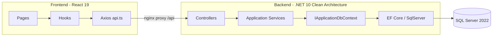

# CRM de Venda de Carros — .NET 10 + React 19 + SQL Server + Docker

Plano de implementação do teste técnico (arquivado em `docs/` para acompanhamento e auditoria). Entrega validada com `docker compose up --build`.

## Decisões confirmadas

- .NET 10 Web API, Clean Architecture com DDD Lite e SOLID
- Acesso a dados via `IApplicationDbContext` (sem Repository Pattern), EF Core + SQL Server
- Testes unitários com xUnit (Services, Validators e QuickOpportunityMatcher)
- Frontend: React 19, TypeScript strict, Vite, Material UI, React Router, Axios, React Hook Form, Zod, TanStack Query, Recharts
- `docker compose up --build` sobe tudo: migrations + seed automático
- Seed pré-carregado (~20 veículos, ~15 clientes, ~25 oportunidades)
- Delete físico com proteção FK → `409 Conflict` (sem cascade)
- Logging com `ILogger` nativo (sem Serilog)
- Scripts: `start.ps1`, `start.sh`, `Makefile` (`make up` / `down` / `logs`)

## Estrutura do repositório

```text
Teste_Tecnico_Impar/
├── docker-compose.yml
├── .env.example
├── start.ps1 / start.sh / Makefile
├── README.md          (seção Características no topo)
├── AGENTS.md
├── docs/ (PLAN, MANUAL, SEMANTIC, QA, TEST_LOG)
├── backend/ (Api, Application, Domain, Infrastructure, UnitTests)
└── frontend/ (Vite React + nginx)
```

## Domain

| Entidade | Campos principais |
|---|---|
| Vehicle | Brand, Model, Year, Price, Color, Mileage, **Type**, Status, CreatedAt, UpdatedAt → **LastModifiedAt** |
| Customer | Name, Email (único), Phone, PrimaryInterest, LastModifiedAt |
| Opportunity | CustomerId, VehicleId, Status, ProposedValue, Notes, LastModifiedAt |

**Enums**

- `VehicleStatus`: Disponivel | Reservado | Vendido
- `VehicleType`: SUV | Hatch | Sedan | Utilitario (Interesse Principal sem CarroUsado/CarroZero)
- `CustomerInterest`: SUV | Hatch | Sedan | Utilitario | CarroUsado | CarroZero
- `OpportunityStatus`: NovoLead | EmNegociacao | PropostaEnviada | Vendido | Perdido

## Regras de negócio

1. E-mail único do cliente → `409 Conflict` se duplicado
2. Opportunity exige Customer e Vehicle existentes
3. Delete Vehicle/Customer com Opportunity → `409`; Opportunity pode ser excluída (hard delete); FKs `Restrict`
4. **Sincronização automática**: ao Create/Update de Opportunity com status `Vendido`, o Vehicle associado passa para `VehicleStatus.Vendido` (e `UpdatedAt`) na mesma transação
5. Ordenação padrão das listagens: **LastModifiedAt** desc (`UpdatedAt ?? CreatedAt`)
6. **Oportunidade Rápida** (listagem de clientes):
   - Círculo verde se houver veículo `Disponivel` compatível; branco caso contrário
   - Branco + clique → "Sem Oportunidade Rápida no momento"
   - Verde + clique → abre `/opportunities/new?customerId&vehicleId&fromQuick=1`
   - Match: CarroZero → KM=0; CarroUsado → KM>0; demais → `Vehicle.Type` = interesse

## API (REST)

- `GET/POST /api/vehicles`, `GET/PUT/DELETE /api/vehicles/{id}` — filtros: search, status, type, brand, year, page, pageSize, sortBy, sortDirection
- `GET/POST /api/customers`, `GET/PUT/DELETE /api/customers/{id}` — resposta inclui `hasQuickOpportunity` / `quickOpportunityVehicleId`
- `GET/POST /api/opportunities`, `GET/PUT/DELETE /api/opportunities/{id}`
- `GET /api/dashboard` — totais + vehiclesByStatus + opportunitiesByStatus
- `GET /health`

**PagedResponse**: Items, Page, PageSize, TotalItems, TotalPages

**HTTP**: 200/201/204/400/404/409/500 — body de erro `{ success, message, errors }` sem stack

**Convenções**: `CancellationToken`, `AsNoTracking()` em leituras, Result Pattern, FluentValidation, AutoMapper, Options Pattern

## Frontend

- Listagens: sort por título **asc → desc → desabilitar**; padrão LastModifiedAt
- Detalhes (Vehicle/Customer/Opportunity): botão **Voltar**
- Veículo: campo **Tipo** obrigatório no form
- Opportunity form:
  - combo de veículos **não lista Vendidos** (exceto seleção atual na edição)
  - via Oportunidade Rápida: alerta explicativo + **círculo verde** antes do nome dos veículos compatíveis
- Dashboard: 3 cards + 2 gráficos Recharts
- UX: loading, empty, snackbar, ConfirmDialog

## Docker

- SQL Server 2022 (`mem_limit: 2g`, healthcheck, ~2 GB RAM no Docker Desktop)
- API multi-stage + retry de conexão + MigrateAsync + seed
- Frontend multi-stage + nginx proxy `/api`
- URLs: frontend `http://localhost:3000` · API/Swagger `http://localhost:5000`

## Documentação

1. README — visão geral + como executar
2. docs/PLAN.md — este plano (decisões, escopo e evoluções)
3. docs/MANUAL.md — pré-requisitos e troubleshooting
4. docs/SEMANTIC.md — arquitetura, domínio, regras (incl. sync Vendido)
5. docs/QA.md — casos de teste por módulo
6. docs/TEST_LOG.md — registro de uso de IA
7. BACKEND_GUIDELINES / FRONTEND_GUIDELINES + AGENTS.md

## Arquitetura



## Evoluções pós-MVP (já incorporadas neste plano)

| Feature | Status |
|---|---|
| Vehicle.Type + migration AddVehicleType | Feito |
| LastModifiedAt e sort padrão | Feito |
| Sort 3 estados na DataTable | Feito |
| Botão Voltar nos detalhes | Feito |
| Oportunidade Rápida (listagem + form highlights) | Feito |
| Combo veículos sem Vendidos | Feito |
| Sync Opportunity Vendido → Vehicle Vendido | Feito |
